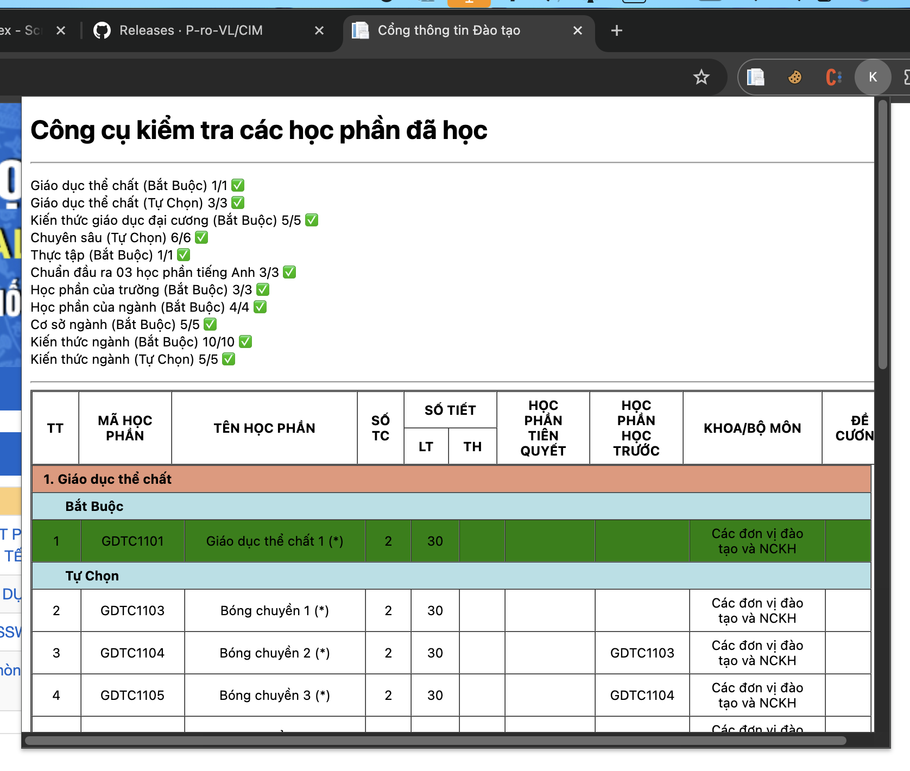
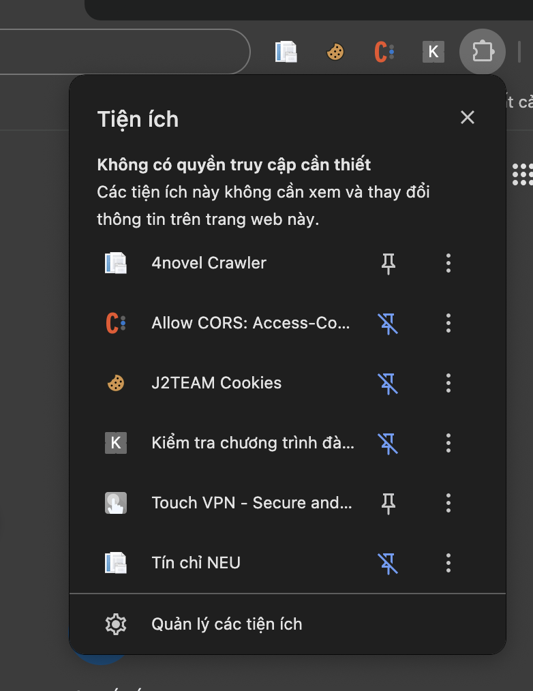
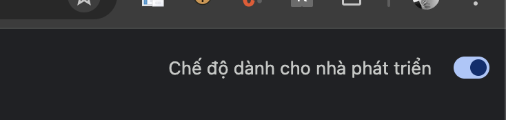
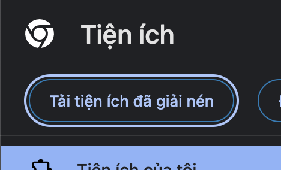
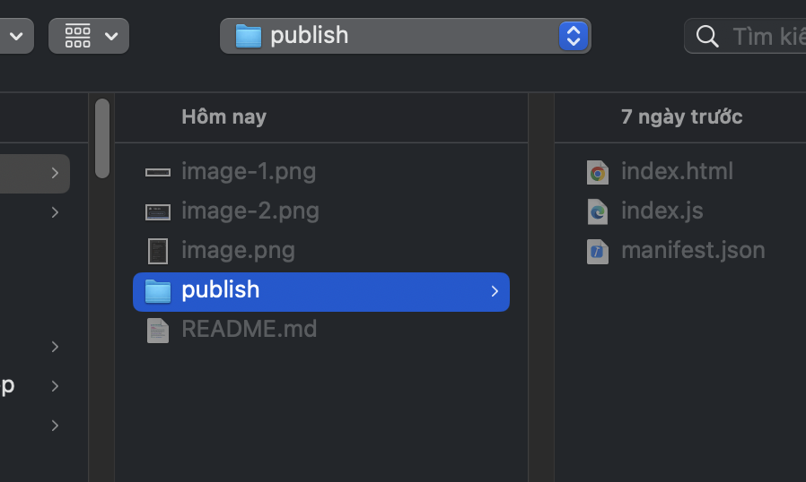
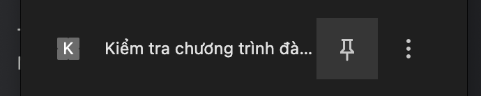
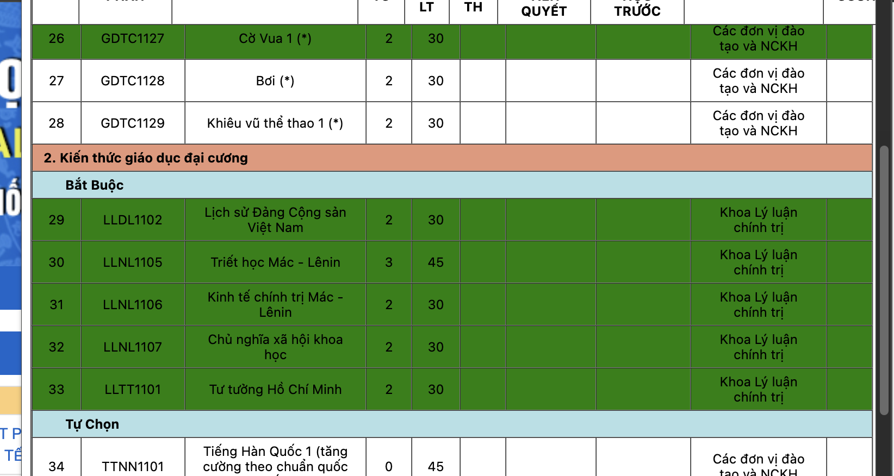

# TOOL KIỂM TRA SỐ LƯỢNG CÁC MÔN HỌC CÒN LẠI ĐỂ HOÀN THÀNH CHƯƠNG TRÌNH ĐÀO TẠO - ĐẠI HỌC KINH TẾ QUỐC DÂN

## Lưu ý: Người dùng cần đăng nhập vào [daihocchinhquy](daihocchinhquy.neu.edu.vn) trước khi sử dụng tool này

### Giới thiệu

Chương trình đào tạo (CTĐT) tại Đại học Kinh tế Quốc dân là đặc thù theo từng ngành đào tạo. Tuy nhiên, sinh viên chỉ cần học đủ số lượng tín chỉ để hoàn thành CTĐT và xét tốt nghiệp, cụ thể:

- Đối với sinh viên K65 về trước: Hoàn thành các học phần bắt buộc; nhóm học phần tự chọn Kiến thức ngành chọn 5 môn; nhóm học phần tự chọn Chuyên sâu chọn 6 môn

- Đối với sinh viên K66 về sau: Hoàn thành các học phần bắt buộc; nhóm học phần tự chọn Chuyên sâu chọn 10 môn

Công cụ này sinh ra để giúp sinh viên nhanh chóng kiểm tra xem với từng nhóm học phần, bản thân còn cần phải hoàn thành bao nhiêu học phần nữa để đủ điều kiện xét tốt nghiệp.

### Techstack

- Chrome API
- Javascript
- HTML, CSS

### Cài đặt

Bước 1: Tải xuống tệp extension [tại đây](https://github.com/P-ro-VL/NEU-Syllabus-Checker/releases)

Bước 2: Tại Chrome/Edge, bấm vào phần Quản lý tiện ích (Manage Extensions)

Bước 3: Tìm dòng Chế độ dành cho nhà phát triển (Developer Mode) và bật lên

Bước 4: Bấm chọn Tải tiện ích đã giải nén (Load unpacked extension) 

Bước 5: Chọn folder `publish` sau khi đã giải nén và bấm Xác nhận

Bước 6: Bấm lại phần Quản lý tiện ích và ghim Extension

Bước 7: Sử dụng: Truy cập [daihocchinhquy](daihocchinhquy.neu.edu.vn), đăng nhập và bấm vào tool đã ghim. Đợi 10s, hệ thống sẽ hiển thị số lượng học phần còn thiếu bạn cần học, đồng thời bôi xanh các học phần bạn đã học

